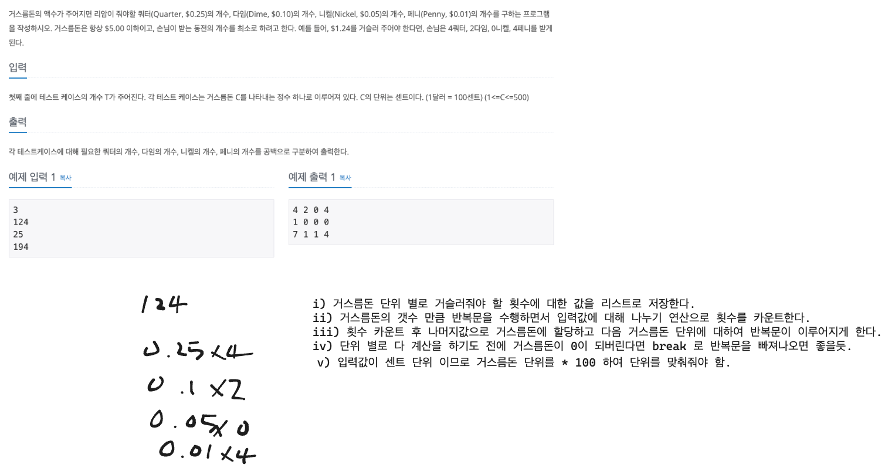

# greedy

## 1이 될 때 까지

### 풀이

1. 가능하면 나누기 연산을 하여 연산의 횟수를 최소화 해야겠다고 생각함.
2. 나누어 떨어지는 수 인지 검증.
3. 나누어 떨어진다면 나누고 몫을 저장.
4. 아닌 경우에는 -1 연산 수행
5. 각 연산에 대하여 카운트

## 곱하기 혹은 더하기

### 풀이

1. 일반적인 경우 더하기 연산보다 곱하기 연산이 더 큰 결과값이 기대됨.
2. 피연산자가 0, 1 일 경우 곱하기 연산보다 더하기 연산이 더 큰 결과값 도출.
3. 배열에 존재하는 정수들을 앞에서 부터 pop 하여 0인지 검증한다.
4. 0일 경우 더하기 연산
5. 아닐 경우 곱하기 연산 하는식으로 구현

## 모험가 길드

### 풀이

1. 모험가의 공포도를 오름차순으로 정렬한다.
2. 모험가의 공포도에 대해 반복문을 실행한다.
3. 현재 그룹에 포함된 모험가의 수가 현재 확인하고 있는 공포도보다 크거나 같다면 이를 그룹으로 결성한다.

## 전자레인지

### 풀이

* https://www.acmicpc.net/problem/10162

## 세탁소 사장 동혁

### 풀이

* https://www.acmicpc.net/problem/2720

