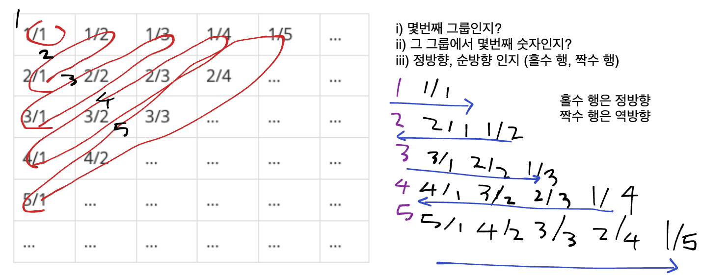

# implementaion

* 일반적으로 풀이를 떠올리는 것은 쉽지만 소스코드로 옮기기 어려운문제를 지칭하여 구현문제로 분류한다.

* 구현 문제 유형의 예시
  * 알고리즘은 간단한데 코드가 지나칠 만큼 길어지는 문제
  * 실수 연산을 다루고, 특정 소수점 자리까지 출력해야 하는 문제
  * 문자열을 특정한 기준에 따라서 끊어 처리해야 하는 문제
  * 적절한 라이브러리를 찾아서 사용해야 하는 문제

## 상하좌우

### Solution

1. 지도에 대한 좌표를 행렬로 생각하여 접근하였음.
2. R U L D 에 대한 2차원 공간에서의 방향 벡터를 dx, dy 리스트로 정의함.
3. 입력받은 방향들에 대해서 반복문을 돌아야 하는데 R U L D 에 대한 문자열로는 방향 벡터에 대한 접근을 할 수 없음.
4. 따라서 R U L D 를 키값으로 가지는 dictionary 를 정의하였고 value 는 방향벡터의 대한 인덱스를 저장하였음.
5. 현재 위치는 x, y 이고 방향벡터와 계산하여 1보다 작거나 n 보다 클때는 좌표값 변경을 하지 않도록 구현.

## 시각

### Solution 1

1. n시 까지 1초식 증가시켜서 완전탐색 (brute forcing) 하는 방식으로 접근함.
2. 문자열로 변환한 시 분 초에 대하여 3이 포함되면 count 를 1 증가 하도록 하였음.
3. 현재시각이 n이하일때 까지 while 문에서 반복.

### Solution 2

1. 시 분 초에 대하여 3중 반복문 수행
2. 문자열로 변환한 시분초에 대하여 3이 포함되면 count 1증가
3. 입력받은 시간에 대하여 반복

## 왕실의 나이트

### Solution 1

1. 8 X 8 형태의 2차원 좌표 평면이 주어짐
2. x 축은 숫자이고 y 축은 a ~ h 범위의 문자열이라 좌표의 이동을 구현하기 위해서 문자열을 아스키코드로 변환하여 연산이 필요하겠다고 생각함.
3. 나이트가 움직일 수 있는 경우는 총 8개라고 판단.
4. 수평으로 왼쪽 2칸으로 움직였을 때에 대하여 위아래로 각 1칸 움직일 수 있어서 이때의 경우의 수가 2가지 이고 수평으로 오른쪽 2칸 움직일때에도 마찬가지로 2가지 여서 총 4가지로 판단하였음.
5. 4번과 같은 접근으로 수직으로 위로 1칸 움직일때 수평으로 왼쪽 오른쪽 2칸씩 이동가능하고 아래로 1칸 움직였을때에도 2가지 경우의 수가 나와서 총 4가지의 경우의수로 구성될 것이라고 판단하였음.
6. 4번과 5번의 경우의수를 모두 합치면 8가지 경우의 수가 나온다.
7. x, y 좌표에 대하여 이동할 모두 경우의 수에 대하여 연산을 진행한다.
8. 전체 좌표의 범위를 벗어나는 범위에 대해서는 카운트하지 않는다.
9. y 좌표의 경우 아스키 코드 97보다 작은수 이거나 104 보다 큰수
10. x 좌표의 경우 1보다 작거나 8보다 큰 수 (좌표 평면이 8 X 8 크기이기 때문이다.)

## 문자열 재정렬

### Solution 1

1. 우선적으로 문자열과 숫자를 구분해야 한다고 생각했다.
2. 그 이유는 문자열은 오름차순 정렬을 해야하고 숫자는 모두 더하는 각각 다른 연산을 해야 할 필요가 있다고 생각했다.
3. 입력받은 문자열을 리스트로 변환하고 pop 메서드를 호출하여 문자 하나씩 숫자인지 대문자 알파벳인지 아스키 코드로 검증한다.
4. 문자열, 숫자 각각 리스트로 저장한 후 문자열은 정렬을 수행하고 숫자는 요소의 값을 모두 더한다.
5. fstring으로 문자열을 먼저 출력한 뒤 숫자를 출력한다.

### Solution2

1. 문자열 메소드로 isalpha 로 알파벳 검증이 가능.
2. list.sort() 메소드로 오름차순 정렬이 가능

## 분수 찾기

### Solution

